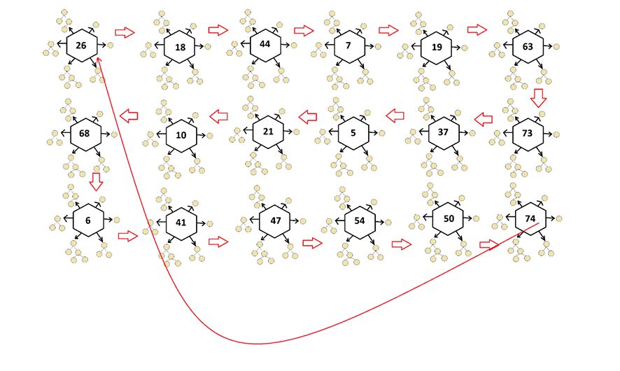

# ⬢ Hexagonal Priority Queue Simulator

Academic project developed during my second year of the **Computer Engineering degree at Sakarya Üniversitesi**.

This project was developed for the **Data Structures** course. It simulates a collection of **hexagonal priority queues**, where each queue stores up to six **Binary Search Trees (BSTs)**. During the simulation, trees are removed according to predefined priority rules and redistributed to neighboring hexagons, allowing the entire system to evolve over multiple rounds.

All data structures were implemented from scratch without using the C++ Standard Template Library (STL).

---

## 🛠 Technologies

- C++
- Object-Oriented Programming
- MinGW
- Makefile

---

## ✨ Features

- Binary Search Tree (BST) implementation
- Hexagonal priority queue simulation
- Circular linked list implementation
- Queue and stack implemented from scratch
- Dynamic tree redistribution between hexagons
- File-based initialization
- Real-time console visualization
- Round-based simulation

---

## 🧠 Data Structure Architecture

```
Circular Linked List
        │
        ▼
 Hexagonal Priority Queue
        │
        ▼
 Binary Search Trees
```

Additional supporting data structures:

- Queue (node transfer)
- Stack (zigzag visualization)

---

## ⚙️ Simulation Rules

- Each hexagon stores up to six Binary Search Trees
- Trees are loaded from a text file
- Tree priority is determined by height
- Odd rounds remove the first tree
- Even rounds remove the highest-priority tree
- Removed trees are traversed in post-order
- Nodes are redistributed across the next hexagon
- The simulation updates the screen after every round

---

## 🖼 Conceptual Model

**Note:** The following diagram is taken from the original university assignment and is included for illustrative purposes. It represents the data flow implemented by the application.

Although the program runs entirely in the console, each displayed number represents the current state of a hexagonal priority queue whose internal structure consists of Binary Search Trees (BSTs). Trees are transferred between neighboring hexagons according to the simulation rules.



---

## 📄 Documentation

The `doc` folder contains:

- Project Report
- Original Assignment Specification

---

## ▶️ How to Build and Run

Open a terminal in the project's root directory and run:

```bash
mingw32-make
```

The Makefile automatically:

- Compiles all source files
- Generates the executable
- Launches the application

---

## 🎓 Academic Information

- **University:** Sakarya Üniversitesi
- **Department:** Computer Engineering
- **Course:** Data Structures
- **Academic Year:** 2025–2026
- **Project Grade:** 100/100

---

## 📌 Notes

This repository preserves the original academic project exactly as it was submitted and evaluated.

The project was implemented entirely with custom data structures, including Binary Search Trees, Circular Linked Lists, Queues, Stacks, and Priority Queues, without using the C++ Standard Template Library (STL).

For more academic projects, visit my **Computer Engineering Projects** repository:

https://github.com/Lucaskatalahali/computer-engineering-projects
